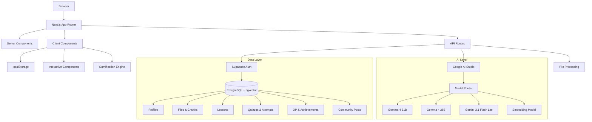

<div align="center">

# 🧠 Ulul Albab — Learn with Lubb AI

**An AI-powered education platform that transforms how you learn, understand, and retain knowledge.**

[](https://nextjs.org/)
[](https://www.typescriptlang.org/)
[](https://supabase.com/)
[](https://tailwindcss.com/)
[-4285F4?style=flat-square&logo=google&logoColor=white)](https://ai.google.dev/)
[](https://vercel.com/)
[](LICENSE)
[](CONTRIBUTING.md)

<a href="https://ululalbab.vercel.app" target="_blank">**🌐 Visit Ulul Albab**</a>

</div>

---

## 📋 Table of Contents

- [Overview](#-overview)
- [Key Features](#-key-features)
- [Tech Stack](#-tech-stack)
- [Architecture](#-architecture)
- [Getting Started](#-getting-started)
- [Environment Variables](#-environment-variables)
- [Database Setup](#️-database-setup)
- [Project Structure](#-project-structure)
- [Interactive Learning Components](#-interactive-learning-components)
- [Theming System](#-theming-system)
- [API Reference](#-api-reference)
- [Contributing](#-contributing)
- [License](#-license)
- [Acknowledgments](#-acknowledgments)

---

## 📖 Overview

**Ulul Albab** (Arabic: أولو الألباب, meaning "People of Understanding") is a next-generation AI-powered learning platform that moves beyond rote memorization toward deep, conceptual understanding. The platform blends advanced AI models with gamification to create an engaging, personalized educational experience.

Named after the Quranic term for those who possess deep insight and understanding, **Ulul Albab** empowers learners to:
- **Upload** study materials (PDFs, slides, documents) and instantly generate interactive content
- **Chat** with Lubb AI — an intelligent AI tutor that understands your materials
- **Practice** with AI-generated quizzes, flashcards, and interactive exercises
- **Compete** with friends through XP, leagues, leaderboards, and achievements

> _"Are those who know equal to those who do not know? Only they will remember \[who are\] people of understanding."_ — Qur'an 39:9

---

## ✨ Key Features

### 🤖 AI-Powered Tutoring

- **Lubb AI** — Intelligent chatbot powered by Google's latest models (Gemma 4 31B, Gemma 4 26B, Gemini 3.1 Flash Lite)
- **Smart Model Routing** — Automatic fallback across multiple models and API keys for high availability
- **Context-Aware Responses** — Upload documents and get answers directly from your own materials
- **Web Search Grounding** — AI can search the web for current information when needed

### 📄 Document Processing

- **Multi-Format Support** — Upload PDFs, DOCX, PPTX, TXT, CSV, JSON, images, and more
- **Automatic Text Extraction** — Extract and chunk content for AI context
- **Image Understanding** — Vision-enabled models can analyze diagrams and images
- **50MB File Limit** — Handles large documents with ease

### 🧩 Interactive Learning Components

A rich library of 12+ interactive component types for hands-on learning:

| Component | Description |
|:---|---|
| **Multiple Choice** | Classic quiz format with instant feedback |
| **True/False** | Quick knowledge checks |
| **Fill in the Blank** | Active recall exercises |
| **Flashcards** | Spaced repetition ready |
| **Matching** | Pair concepts and definitions |
| **Sorting** | Order items correctly |
| **Timeline** | Visualize chronological relationships |
| **Concept Slider** | Adjust parameters to understand ranges |
| **Hotspot** | Identify regions in diagrams |
| **Free Response** | Open-ended questions with rubrics |
| **Branching Scenarios** | Explore "what-if" outcomes |
| **Categorize** | Group items into categories |

### 🏆 Gamification System

- **XP & Leveling** — Earn experience points for every interaction
- **Daily Streaks** — Build consistent study habits
- **Achievements** — 13+ unlockable achievements with icons and descriptions
- **Leaderboards** — Compare progress with the community
- **13 Achievement Types** — From "First Steps" to "Unstoppable" (30-day streak)

### 🌐 Community

- **Discussion Posts** — Share knowledge and ask questions
- **Voting System** — Upvote/downvote quality content
- **Comments** — Engage in threaded discussions
- **User Profiles** — Track learning journeys

### 🎨 Multi-Theme Design

6 professionally designed themes that adapt to any user preference:

| Theme | Best For | Vibe |
|:---|---:|---:|
| **Modern Normal** | Professional use | Clean monochrome |
| **Cozy** | Comfortable studying | Warm cream & coral |
| **Sunshine Arcade** | K-12 learners | Bright & playful |
| **Dark Quest** | Teens & adults | Dark RPG aesthetic |
| **Cosmic Academy** | STEM learners | Deep space sci-fi |
| **Candy Pastel** | Early learners (4-8) | Soft & dreamy |

Each theme includes both light and dark modes with carefully crafted color palettes, typography, and component styling.

### 📊 Data Privacy First

- All user data stored in **localStorage** — nothing leaves your browser except AI API requests
- No external analytics or tracking
- Export your data anytime as JSON
- Open-source database schema with Row-Level Security

---

## 🛠 Tech Stack

| Layer | Technology |
|:---|---:|
| **Framework** | [Next.js](https://nextjs.org/) 16 (App Router) |
| **Language** | [TypeScript](https://www.typescriptlang.org/) 5 (strict mode) |
| **Styling** | [Tailwind CSS](https://tailwindcss.com/) 4 + [shadcn/ui](https://ui.shadcn.com/) |
| **Auth & Database** | [Supabase](https://supabase.com/) (Auth, PostgreSQL 15, RLS) |
| **Vector Store** | pgvector (768-dim embeddings) |
| **AI Models** | [Google AI Studio](https://ai.google.dev/) — Gemma 4, Gemini 3.1 Flash Lite |
| **AI SDK** | [Vercel AI SDK](https://sdk.vercel.ai/) 6 |
| **Deployment** | [Vercel](https://vercel.com/) (Edge Network) |
| **Package Manager** | npm / pnpm |
| **Linting** | ESLint 9 + Next.js core-web-vitals |

### Key Dependencies

| Package | Purpose |
|:---|---:|
| `@ai-sdk/google` | Google AI model integration |
| `@supabase/ssr` | Supabase server-side auth |
| `ai` | Vercel AI SDK for streaming |
| `katex` | Math/LaTeX rendering |
| `react-markdown` | Markdown rendering |
| `mammoth` | DOCX text extraction |
| `pdf-parse` | PDF text extraction |
| `next-themes` | Theme management |
| `sonner` | Toast notifications |
| `lucide-react` | Icon library |

---

## 🏗 Architecture



### Data Flow

1. **User Uploads Material** → File is extracted, chunked, and optionally embedded for RAG
2. **User Chats with Lubb AI** → Messages are streamed via Vercel AI SDK with smart model fallback
3. **User Generates Content** → Lessons and quizzes are created and stored in localStorage
4. **User Earns XP** → Gamification state tracks interactions, streaks, and achievements locally
5. **Community Features** → Posts and comments are stored locally with vote tracking

### Security Architecture

- **Content Security Policy** — Strict CSP headers blocking XSS and data injection
- **Rate Limiting** — 20 requests per 60 seconds per IP
- **Row-Level Security** — All Supabase tables protected with granular policies
- **OAuth 2.0** — Google authentication via Supabase Auth
- **HTTP Security Headers** — `X-Frame-Options: DENY`, `X-Content-Type-Options: nosniff`, `Referrer-Policy: strict-origin-when-cross-origin`

---

## 🚀 Getting Started

### Prerequisites

- [Node.js](https://nodejs.org/) 18+ (LTS recommended)
- [npm](https://www.npmjs.com/) or [pnpm](https://pnpm.io/)
- A [Supabase](https://supabase.com/) project
- A [Google AI Studio](https://aistudio.google.com/) API key

### Installation

```bash
# Clone the repository
git clone https://github.com/your-username/ai-education-platform.git
cd ai-education-platform

# Install dependencies
npm install

# Copy environment variables
cp .env.example .env.local
```

### Development

```bash
# Start the development server
npm run dev
```

Open [http://localhost:3000](http://localhost:3000) in your browser. The app supports hot module replacement for a seamless development experience.

### Build & Production

```bash
# Build for production
npm run build

# Start production server
npm start
```

### Linting

```bash
# Run ESLint
npm run lint
```

---

## 🔐 Environment Variables

Create a `.env.local` file in the project root with the following variables:

| Variable | Required | Description |
|:---|---:|:---|
| `NEXT_PUBLIC_SUPABASE_URL` | ✅ | Supabase project URL |
| `NEXT_PUBLIC_SUPABASE_ANON_KEY` | ✅ | Supabase anonymous API key |
| `SUPABASE_SERVICE_ROLE_KEY` | ❌ | Supabase admin key (for server-side) |
| `SUPABASE_JWT_SECRET` | ❌ | JWT secret for auth verification |
| `DATABASE_URL` | ❌ | Direct PostgreSQL connection string |
| `GOOGLE_API_KEY_1` | ✅ | Google AI Studio API key |
| `GOOGLE_API_KEY_2` | ❌ | Additional API key (rotates for rate limits) |
| `GOOGLE_API_KEY_N` | ❌ | Add more keys as needed (e.g., `_2`, `_3`, etc.) |
| `VERCEL_TOKEN` | ❌ | Vercel deployment token |

> **Note on API Keys:** The platform supports multiple Google AI API keys. If you add more keys (e.g., `GOOGLE_API_KEY_2`, `GOOGLE_API_KEY_3`), the `AIKeyManager` will automatically rotate through them, providing better rate-limit tolerance and higher throughput.

---

## 🗄️ Database Setup

### Supabase Schema

Run the migration files in order in the [Supabase SQL Editor](https://supabase.com/dashboard/project/_/sql/new):

```bash
# Order of migrations
supabase/migrations/00001_initial_schema.sql   # Core tables, RLS, pgvector
supabase/migrations/00002_add_storage_path.sql  # Storage path column
supabase/migrations/00003_fix_rls_policies.sql  # Security hardening
supabase/migrations/00004_harden_auth.sql       # Auth hardening
```

### Database Tables

| Table | Purpose |
|:---|---:|
| `profiles` | User profiles with XP, levels, streaks |
| `xp_transactions` | XP earning log |
| `achievements` | Unlocked achievements |
| `files` | Uploaded study materials |
| `file_chunks` | Text chunks with 768-dim vector embeddings |
| `lessons` | AI-generated lessons (JSONB content) |
| `quizzes` | AI-generated quizzes (JSONB questions) |
| `quiz_attempts` | User quiz scores and answers |
| `community_posts` | Discussion posts |
| `post_comments` | Post comments |
| `post_votes` | Upvote/downvote tracking |

### Vector Search

The `file_chunks` table uses **pgvector** with 768-dimensional embeddings for semantic search. An IVFFlat index is configured for efficient cosine similarity queries:

```sql
CREATE INDEX idx_file_chunks_embedding 
ON public.file_chunks 
USING ivfflat (embedding vector_cosine_ops) 
WITH (lists = 100);
```

---

## 📁 Project Structure

```
├── public/                          # Static assets
│   ├── .well-known/
│   │   └── security.txt            # Security disclosure policy
│   └── google*.html                # Google Search Console verification
├── src/
│   ├── app/                        # Next.js App Router
│   │   ├── auth/                   # Authentication pages
│   │   │   └── callback/           # OAuth callback handler
│   │   ├── blog/                   # Educational blog
│   │   │   └── [slug]/             # Individual blog posts
│   │   ├── dashboard/              # Protected dashboard
│   │   │   ├── chat/               # AI chat interface
│   │   │   ├── lessons/            # Saved lessons
│   │   │   ├── quizzes/            # Saved quizzes
│   │   │   ├── community/          # Discussion forum
│   │   │   ├── leaderboard/        # XP rankings
│   │   │   ├── profile/            # User profile
│   │   │   ├── settings/           # App settings
│   │   │   └── files/              # File uploads (redirects to chat)
│   │   ├── api/
│   │   │   ├── chat/               # AI streaming endpoint
│   │   │   └── files/process/      # File upload & extraction
│   │   ├── privacy/                # Privacy policy
│   │   ├── terms/                  # Terms of service
│   │   ├── layout.tsx              # Root layout with fonts & metadata
│   │   ├── page.tsx                # Landing page
│   │   └── globals.css             # Global styles & 6 themes
│   ├── components/
│   │   ├── ui/                     # shadcn/ui components
│   │   ├── interactive/            # 12 learning components
│   │   ├── gamification/           # XP, badges, achievements
│   │   ├── theme-provider.tsx      # Theme context
│   │   └── theme-switcher.tsx      # Theme selector UI
│   ├── hooks/                      # Custom React hooks
│   │   ├── use-gamification.ts     # XP, levels, streaks, achievements
│   │   ├── use-chat-storage.ts     # Chat persistence
│   │   ├── use-lessons-storage.ts  # Lessons CRUD
│   │   ├── use-quizzes-storage.ts  # Quizzes CRUD
│   │   └── use-community-storage.ts # Community features
│   ├── lib/
│   │   ├── ai/                     # AI integration layer
│   │   │   ├── models.ts           # Model router & streaming
│   │   │   ├── embedding.ts        # Text embeddings
│   │   │   └── key-manager.ts      # Multi-key rotation
│   │   ├── supabase/               # Database clients
│   │   │   ├── client.ts           # Browser client
│   │   │   ├── server.ts           # Server client
│   │   │   └── middleware.ts       # Session middleware
│   │   ├── files/
│   │   │   └── extract.ts          # File text extraction
│   │   └── utils.ts                # Utility functions
│   ├── types/                      # TypeScript type definitions
│   │   ├── index.ts                # Domain types
│   │   └── interactive.ts          # Interactive component types
│   └── middleware.ts               # Next.js middleware (auth + rate limit)
├── supabase/
│   └── migrations/                 # Database migrations
├── .github/workflows/              # CI/CD pipelines
│   └── deploy.yml                  # Vercel deployment
├── next.config.ts                  # Next.js config + security headers
├── vercel.json                     # Vercel deployment config
└── tsconfig.json                   # TypeScript configuration
```

---

## 🧩 Interactive Learning Components

Located in `src/components/interactive/`, these components form a custom-built interactive engine:

| Component | File | Description |
|:---|---:|:---|
| `renderer.tsx` | `InteractiveContent` | Auto-detects and renders component types from `<component_name>` tags |
| `multiple-choice.tsx` | `MultipleChoice` | Select correct answer with feedback animations |
| `true-false.tsx` | `TrueFalse` | Boolean knowledge checks |
| `fill-blank.tsx` | `FillBlank` | Text input with answer matching |
| `flashcard.tsx` | `Flashcard` | Flip-to-reveal spaced repetition cards |
| `matching.tsx` | `Matching` | Drag-to-match concept pairs |
| `sorting.tsx` | `Sorting` | Arrange items in correct order |
| `timeline.tsx` | `Timeline` | Interactive chronological sequences |
| `concept-slider.tsx` | `ConceptSlider` | Adjustable parameter exploration |
| `hotspot.tsx` | `Hotspot` | Diagram region identification |
| `free-response.tsx` | `FreeResponse` | Open-ended text input |
| `branching-scenario.tsx` | `BranchingScenario` | Decision tree exploration |

Components can be embedded directly in AI responses using tagged format:

```
<multiple_choice>
question: "What is the capital of France?"
options: ["London", "Paris", "Berlin", "Madrid"]
correctIndex: 1
</multiple_choice>
```

---

## 🎨 Theming System

The platform features 6 professionally designed themes, each with light and dark modes. Themes control:

- **Color palettes** — Primary, secondary, accent, background, text
- **Typography** — Custom font families for headings, body, display, and mono
- **Border radii** — Theme-specific rounding for cards, buttons, inputs
- **Shadows** — Card shadows, button shadows, glow effects
- **Special effects** — Star fields (Cosmic), animated glows (Dark Quest)

Themes are stored in `localStorage` under the key `ulul-albab-theme` and applied via the `data-theme` attribute on `<html>`. The `ThemeSwitcher` component provides an intuitive UI for switching with a live preview.

---

## 📡 API Reference

### POST `/api/chat`

Stream AI responses using Lubb AI.

**Request:**
```json
{
  "messages": [{ "role": "user", "content": "Explain quantum computing" }],
  "context": "Optional document text for context-aware answers",
  "files": [{ "name": "diagram.png", "dataUrl": "data:image/png;base64,...", "type": "png" }]
}
```

**Response:** Server-Sent Events (SSE) stream with JSON-encoded deltas:
```
{"t":"text-delta","c":"text content..."}
{"t":"done"}
{"t":"error","c":"error message"}
```

### POST `/api/files/process`

Upload and extract text from documents.

**Request:** `multipart/form-data` with a `file` field

**Response:**
```json
{
  "name": "document.pdf",
  "type": "pdf",
  "size": 1024000,
  "text": "Extracted text content...",
  "pages": 12,
  "dataUrl": "data:image/png;base64,...",
  "unprocessable": false
}
```

---

## 🤝 Contributing

We welcome contributions from the community! Whether you're fixing bugs, adding features, or improving documentation, your help is appreciated.

### Getting Started

1. **Fork** the repository
2. **Create a branch** — `git checkout -b feature/amazing-feature`
3. **Commit** your changes — `git commit -m 'Add amazing feature'`
4. **Push** to the branch — `git push origin feature/amazing-feature`
5. **Open a Pull Request**

### Guidelines

- **Code Style** — TypeScript strict mode, ESLint configured
- **Components** — Follow the established pattern in `src/components/`
- **Types** — Define or extend types in `src/types/`
- **Hooks** — Follow the storage hook pattern for new data features
- **Testing** — Ensure existing functionality is not broken

### Report Issues

Found a bug? [Open an issue](https://github.com/your-username/ai-education-platform/issues/new) with:
- A clear title and description
- Steps to reproduce
- Expected vs actual behavior
- Screenshots if applicable

---

## 📄 License

Copyright © 2026 Sakibur Rahman. All rights reserved.

---

## 🙏 Acknowledgments

- **Google AI Studio** — For providing access to cutting-edge AI models (Gemma, Gemini)
- **Supabase** — For the open-source BaaS platform
- **shadcn/ui** — For the beautiful component library
- **Vercel** — For the deployment infrastructure
- **The Quranic Concept of Ulul Albab** — Inspiring the mission of deep, understanding-based education

---

<div align="center">

**Built with ❤️ for lifelong learners everywhere**

[⬆ Back to Top](#-ulul-albab--learn-with-lubb-ai)

</div>
